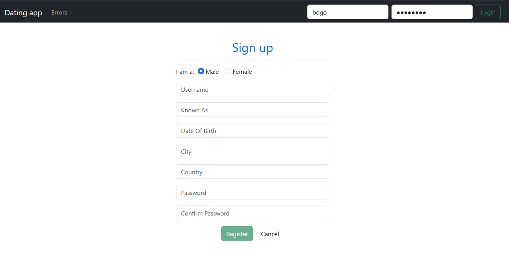
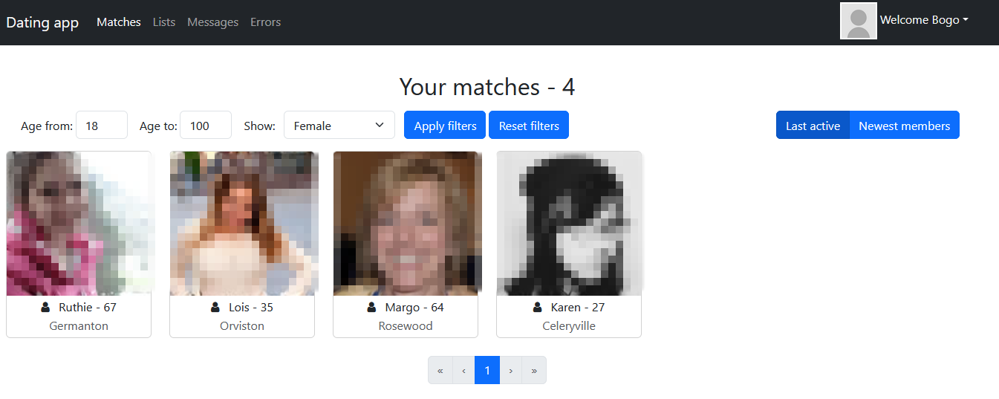
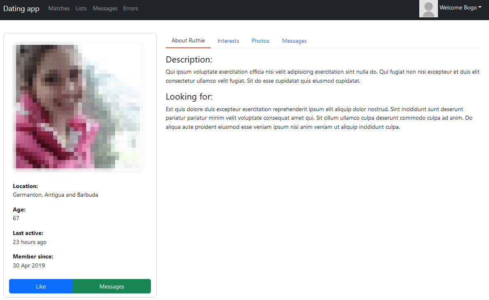
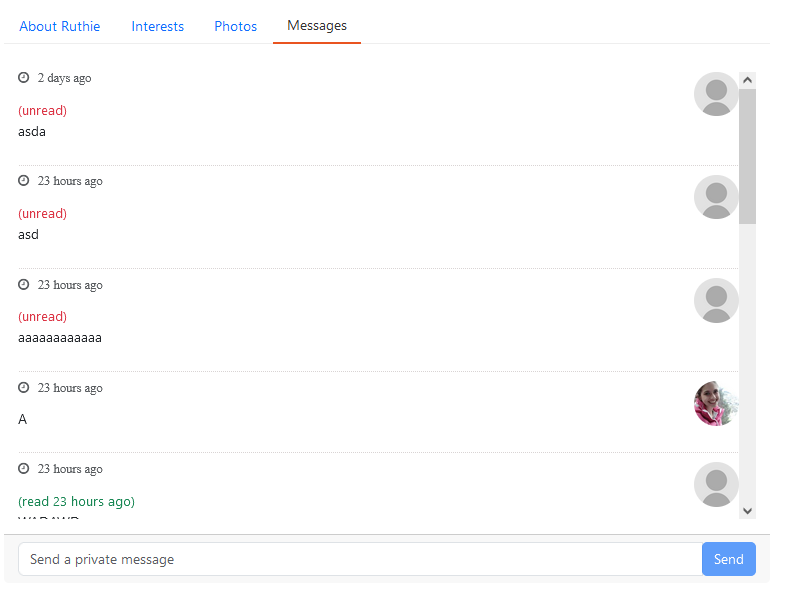
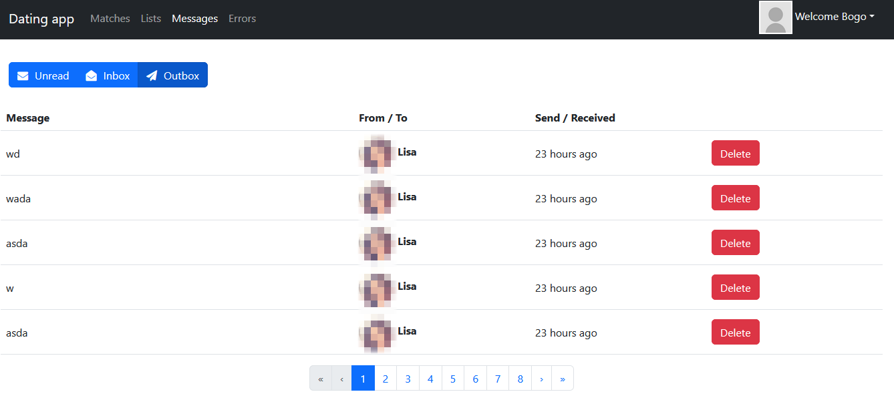

# Dating app 
Simple dating app created using:

| Frontend         | Backend    | Additional libraries |
|--------------|-----------|------------|
| **Angular** | **.NET**      | Bootstrap        |
|   JWT    | SQLite  |    Angular Bootstrap   |
|       | SingalIR  |      |
|       | JWT  |       |

## Features
- Users can like and message other users
- Users can update their own profile and upload pictures
- Real-time chat and notifications for incoming messages
- Admin panel where Admin can update roles of users (Has no use right now)

## Planned features 
- BUGFIXES !! RIGHT NOW EXTREMELY BUGGY !!
- Complete rewrite
    - Complete rewrite of code and styling
    - Rewrite for Spring Boot and React.js or PHP
    - Change of Database for MongoDB and MySQL/PostreGres
    - Caching 
- Friendlist - Users will be able to add friends
- Friend stories 
   - Users will be able to post short "stories" (30 sec. videos)
- Blocking and Reporting users
- Proper Photo/User management - Admins and Moderators will be able to delete/block photos and users
- Proper Admin/Moderator pannels
- Mobile version using Kotlin (Probably never)

#### **Will be implemented in the future (I got bored)**

## Images

